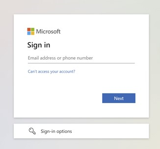
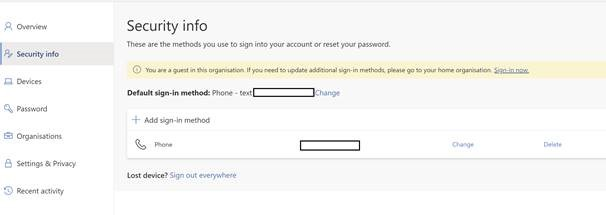
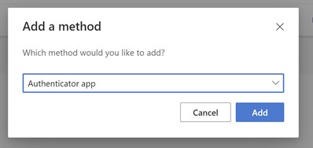

# IRIS client troubleshooting

## Issues when trying to migrate Microsoft Authenticator credentials for IRIS

    
<h3>"Action required: Scan the QR code provided by your organisation to finish recovering this account"</h3>

If you encounter this error when attempting to migrate multi-factor authentication to a new device:

1. In an incognito tab visit "https://mysignins.microsoft.com/security-info"
2. Click "Sign-in options" at the bottom of the Microsoft sign-in page (image?)

3. From the options, click "Sign in to an organisation"
4. Type "elexon.co.uk" and click "Next"
5. In the subsequent sign-in screen, enter the email you/the user signed up with, and click "Next". Continue the sign-in process as normal
6. Once you have signed in, navigate to "Security info" (in the settings menu?) and select "Add sign-in method"

7. In the "Add a method" tab that pops up, choose "Authenticator App" and then "Add"

8. Follow the wizard until you reach the QR code, and then scan that in the app

